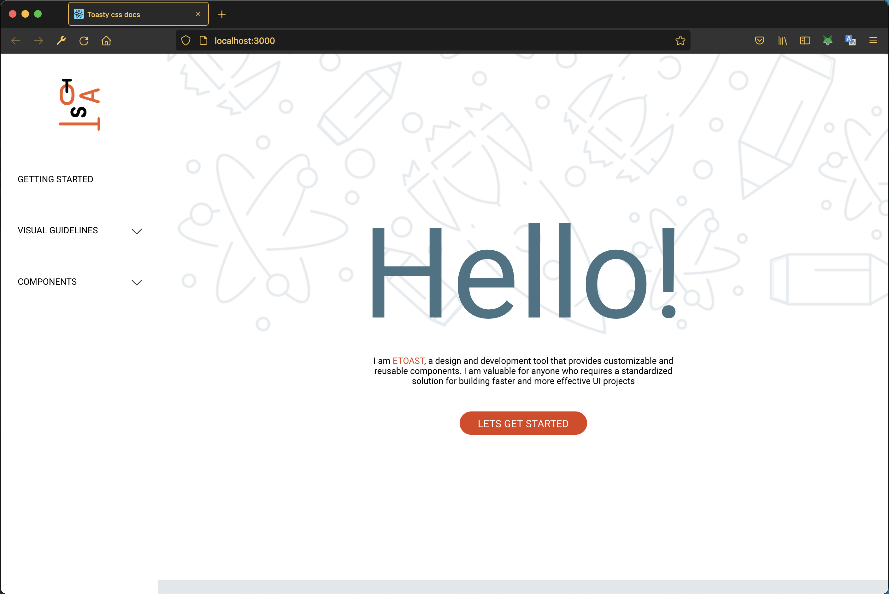
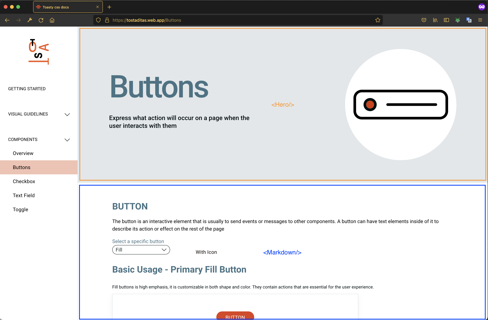

# 📃 css/css-doc-page

React project to document the contents of `e-toast/css`. This project is hosted on [tostaditas](https://tostaditas.web.app/)

# 🧰 Tech Stack


# 🚀 Launch

1. Install dependencies for the css project

```zsh
npm install
```

2. Build the css package:

```zsh
npm run build
```

3. Start the local server:

```zsh
npm run start
```

4. Open [http://localhost:3000](http://localhost:3000) to view it in the browser.

> Note: if the port 3000 is being used by another project, the command line will ask you if you want to mount the server in a different port.

Your localhost should looks like:



## 📖 Usage

The documentation of each component has the next structure:

1. `<Hero>`
2. `<Markdown>`

Both are React components with illustrated in the next image:



To create the documentation of a new component follow the next steps:

1. Create a Markdown file for your component in `packages/css-doc-page/src/assets/markdown/{component}/file.md`.
2. Add a view in a new folder called `packages/css-doc-page/src/views/{componentDoc}` with the next files: `componentDoc.jsx`, `componentDoc.scss` and `index.js`.
3. In the `componentDoc.jsx` follow the `<Hero/> + <Markdown/>` structure.
4. Import the markdown files of step one, and use them as a prop of the `<Markdown/>` component.
5. Associate the view path in the `packages/css-doc-page/src/containers/sidebar/Sidebar.jsx`
6. Test your changes.

```
const cssDocPage = require('css-doc-page');

// TODO: DEMONSTRATE API
```
