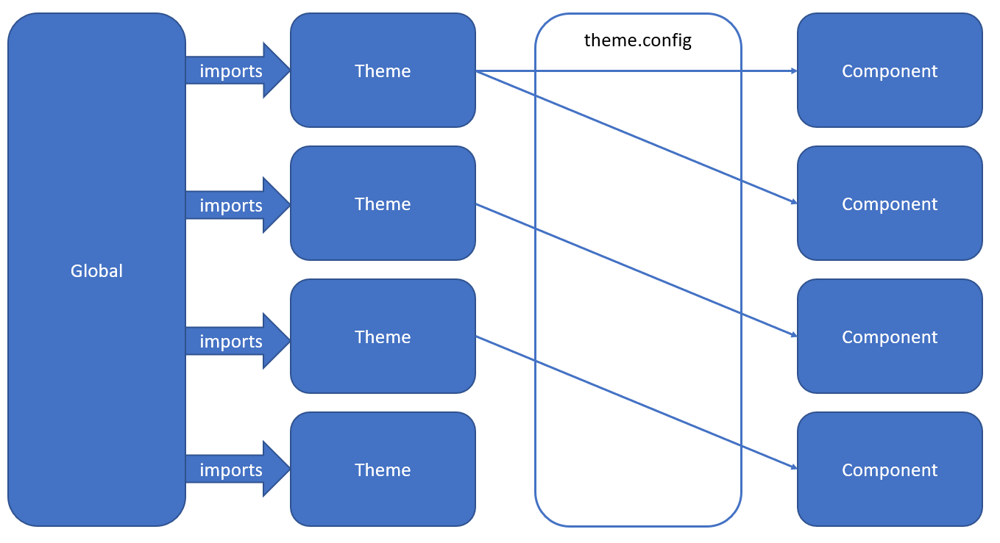

# 💅 @e-toast/css
Starting using e-toast is straight forward. We provide resources such as best practices, component documentation, sketch and Figma files, and more.

# 🏗️ Build

1. Install dependencies for the css project

```zsh
npm install
```

2. Build the css package:

```zsh
npm run build
```
# 📁 Folder Structure
This repository use [lerna](https://github.com/lerna/lerna) a tool for manage JavaScript projects with multiple packages. In that case the recommendation is follow the resources in the `/packages` folder that have the next contents:

- `/docs`: folder to store the docs of the css project
- `/sass`: compiled folder with the contents of the `src` folder
- `/scripts`: folder with the script to consume themes for e-toast
- `/src`: main folder
- `/src/atoms`: folder with the e-toast atoms
- `/src/globals`: folder with the e-toast globals
- `/src/themes`: folder with the customizable themes for e-toast
- `/src/utility`: folder for the elements that complement e-toast

For more information, please read the respective `README.md` files for each project.

# 🧰 Tech Stack

- 
- Dart-sass for sass compilation
- Gulp as task runner
- Node for some pre compilation scripts

# 🎨 Custom Themes

The customization of the design system is possible thank to the group for these tokens:

- Colors
- Fonts
- Shapes

To create your own theme, please follow the next steps

1. Go to `/src/themes`
2. Duplicate the  `/src/themes/default` and rename with your theme name (e.g. `src/themes/my-theme/`)
3.  Update the values in the `src/themes/my-theme/constants/colors.scss` if you want to customize the colors of your theme. We can replicate the same process for update fonts and shapes.
4. In the `/src/theme.config` file update the value of the component that you want to consume with a customize theme from `default` to `my-theme`, in this case.
5. Save your changes and review the updates in the sandbox project

# ✈️ CSS Release

> TODO: Complete release guide

To do a release run `npm run release:css`. Keep in mind this process will create a release branch and build the release artifact on your local repo. **Save your progress before running this command**. After finishing your release simply `git stash` and move to the development branch (`git checkout develop`), deleting any remaining release files afterwards.

# 📐 Architecture

The e-toast architecture is made with customization in mind. It allows for different levels of customization. Each level differs from the other based on two characteristics: _scale_ and _semantic_ value. Scale is defined by how many components are affected by the level. Semantic value is defined by the meaning given to values from that level. The following table describes the three levels of abstraction:

| level | scale | semantic value | where it is located |
| ----- | ----- | -------------- | ------------------- |
| global | Values altered in this level will change the design system as a whole | Values are raw values with no semantic value (e.g. orange) | src/globals |
| theme  | Values altered in this level will change groups of components in the system | Values now have a semantic value that ties them to the components (e.g. orange becomes primary). Some values may be tied to a group of components | src/themes |
| component | Values altered at this level only have an effect on a single component in the system | Values are completely tied to a single component (e.g. primary becomes idle-fill-color for the primary button). The values stored here are the tokens used in the definition of a component. | src/themes/\[atom-name]. Definitions that consumes the layer is in src/atoms/\[atom-name] |
| utility | Definitions in this layer may affect the system as a whole | All definitions in this layer are not values but rather functionalities that are not tied to a single component and can be reused system-wide | src/utils |

As a design decision, each layer may only refer to definitions and values from either the utils layer or the layer previous to it in terms of scale and semantic value. This means component layer may only use theme values and theme may only use global values and any layer may use utility definitions.

Additionally, the global layer is unique but the theme and component layer contain various themes and components. Components are connected to a theme through a file that acts as a bridge: src/theme.config. The theme layer is connected to the global layer through imports. The following diagram shows how this works:

