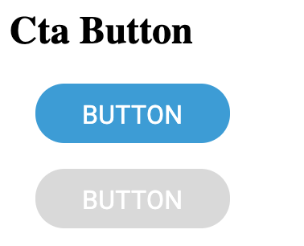

# Buttons

## Overview

Call To Action buttons are the used to guide users towards goal conversion. It's the part of the landing page that the user needs to click in order to take the action you want them to take. Some common examples of call-to-action buttons are:

Add to cart buttons
Free trial sign-up buttons
Download buttons

## Usage
```
<button class="eds-cta-button">Button</button>
```

## Example



## Variants

Disabled button

`<button class="eds-cta-button" disabled>Button</button>`

Button with icon

`<button class="eds-cta-button icon-add">Button</button>`

To see the diferent icon variants, see the Icons documentation

## Local Tokens

| token              | default value                     | description                                  |
| ------------------ | --------------------------------- | -------------------------------------------- |
| $idle-font-color   | theme.colors.$white               | Text color                                   |
| $idle-fill-color   | theme.colors.$cta                 | Fill color                                   |
| $hover-font-color  | theme.colors.$white               | Text color on hover                          |
| $hover-fill-color  | theme.colors.$dark-contrast-cta   | Fill color on hover                          |
| $focus-font-color  | theme.colors.$white               | Text color on focus                          |
| $focus-fill-color  | theme.colors.$cta                 | Fill color on focus                          |
| $disable-font-color| theme.colors.$white               | Text color while disabled                    |
| $disable-fill-color| theme.colors.$disable             | Fill color while disabled                    |
| $border-radius     | theme.shape.$button-radius        | Smooth corners radius                        |
| $border-width      | 1px                               | Border line width                            |
| $height            | 37px                              | Button height                                |
| $padding-top       | 11px                              | Separation between top border and text       |
| $padding-right     | 28px                              | Separation between right border and text     |
| $padding-bottom    | 11px                              | Separation between bottom border and text    |
| $padding-left      | 28px                              | Separation between left border and text      |
| $font-name         | theme.fonts.$button-font          | Text font family                             |
| $font-weight       | theme.fonts.$button-weight        | Text font weight                             |
| $font-size         | theme.fonts.$button-size          | Text font size                               |
| $line-height       | theme.fonts.$button-line-height   | Text line height                             |
| $spacing           | theme.fonts.$button-spacing       | Text letter spacing                          |


## Theme Tokens
| token                 | default value                      | description            |
| --------------------- | ---------------------------------- | ---------------------- |
| $white                | global.colors.$white               | White color            |
| $cta                  | global.colors.$blue                | CTA color              |
| $dark-contrast-cta    | global.colors.$cta-dark            | Dark contrast CTA color|
| $disable              | global.colors.$disable             | Disabled contrast color|
| $button-radius        | global.shape.$pill-radius          | Border radius          |
| $button-font          | global.fonts.$font-name            | Text font name         |
| $button-weight        | global.fonts.$regular              | Text font weight       |
| $button-size          | global.fonts.$px-button            | Text font size         |
| $button-line-height   | global.fonts.$lh-button            | Text line height       |
| $button-spacing       | 0.16px                             | Text letter spacing    |


## Global Tokens
| token         | default value | description             |
| ------------- | ------------- | ----------------------- |
| $white        | #fff          | White color             |
| $blue         | #379BD7       | White color             |
| $cta-dark     | #0C2A3C       | Dark Blue color       |
| $disable      | #D9D9D9       | Disabled color          |
| $pill-radius  | 24px          | Border radius           |
| $font-name    | Roboto        | Font family             |
| $regular      | 400           | Font weight             |
| $px-button    | 16px          | Button font size        |
| $lh-button    | 15px          | Button text line height |

