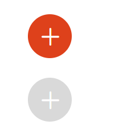

# Buttons

## Overview

 Icon buttons are round buttons without a label, but with an icon

## Usage
```
<button class="eds-icon-button icon-add">Button</button>
```

## Example



## Variants

Disabled button

`<button class="eds-icon-button icon-add" disabled>Button</button>`

To see the diferent icon variants, see the Icons documentation

## Local Tokens

| token              | default value                     | description                                  |
| ------------------ | --------------------------------- | -------------------------------------------- |
| $idle-font-color   | theme.colors.$background          | Text color                                   |
| $idle-fill-color   | theme.colors.$primary             | Fill color                                   |
| $hover-font-color  | theme.colors.$background          | Text color on hover                          |
| $hover-fill-color  | theme.colors.$primary-dark        | Fill color on hover                          |
| $focus-font-color  | theme.colors.$background          | Text color on focus                          |
| $focus-fill-color  | theme.colors.$primary-dark        | Fill color on focus                          |
| $disable-font-color| theme.colors.$background          | Text color while disabled                    |
| $disable-fill-color| theme.colors.$disabled            | Fill color while disabled                    |
| $border-radius     | 50%                               | Smooth corners radius                        |
| $border-width      | 1px                               | Border line width                            |
| $height            | 37px                              | Button height                                |
| $padding           | 10px                              | Separation between border and icon           |
| $font-size         | 0                                 | Text font size                               |
| $icon-size         | 16px                              | Icon size                                    |


## Theme Tokens
| token                 | default value                      | description            |
| --------------------- | ---------------------------------- | ---------------------- |
| $background           | global.colors.$white               | Base color             |
| $primary              | global.colors.$orange              | White color            |
| $primary-dark         | global.colors.$orange-dark         | Dark contrast color    |
| $disabled             | global.colors.$disable             | Disabled contrast color|

## Global Tokens
| token         | default value | description             |
| ------------- | ------------- | ----------------------- |
| $white        | #fff          | White color             |
| $orange       | #DE411B       | Orange color            |
| $orange-dark  | #401308       | Dark Orange color       |
| $disable      | #D9D9D9       | Disabled color          |
