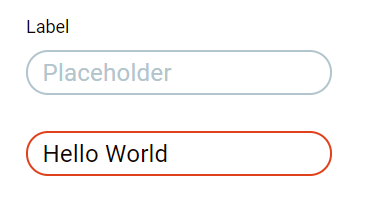

# Component Name
 
## Overview
 
General purpose html inputs for user inputs and forms
 
## Usage

```html
<div class="eds-outline-input__container">
    <input class="eds-outline-input" >
</div>
```

## Example



## Variants

Success

```html
<input class="eds-outline-input eds-outline-input--success" >
```

Error 

```html
<input class="eds-outline-input eds-outline-input--error" >
```

Disabled

```html
<input class="eds-outline-input" disabled>
```

Labeled Input

```html
<div class="eds-outline-input__container">
    <div class="eds-outline-input__label">
        <label class="eds-outline-input__label__text">
            This is an input
        </label>
    </div>
    <input class="eds-outline-input" >
</div>
```

Labeled Input Error

```html
<div class="eds-outline-input__container">
    <div class="eds-outline-input__label">
        <label class="eds-outline-input__label__text">
            This is an input
        </label>
        <div class="eds-outline-input__label__error-alert">
            There is something wrong
        </div>
    </div>
    <input class="eds-outline-input eds-outline-input--error">
</div>
```

## Local Tokens
 
| token | default value | description |
| -------------------------- | --------------------- | ------------ |
| $idle-font-color           | theme.colors.$content | font color for the content when idle |
| $idle-background-color     | theme.colors.$background | background of the input when idle |
| $idle-border-color         | theme.colors.$secundary-mid | border of the input when idle |
| $active-font-color         | theme.colors.$content | font color for the content when active |
| $active-background-color   | theme.colors.$background | background of the input when active |
| $active-border-color       | theme.colors.$primary | border of the input when active |
| $focus-font-color          | theme.colors.$content | font color for the content when focused |
| $focus-background-color    | theme.colors.$background | background color of the input when focused|
| $focus-border-color        | theme.colors.$primary | border color of the input when focused |
| $disabled-font-color       | theme.colors.$disabled | font color for the content when disabled |
| $disabled-background-color | theme.colors.$background | background color of the input when disabled  |
| $disabled-border-color     | theme.colors.$disabled | border color of the input when disabled |
| $label-font-color          | theme.colors.$content | font color for the label when idle |
| $label-error-font-color    | theme.colors.$danger | font color for the label when in error state |
| $placeholder-font-color    | theme.colors.$secundary-mid | font color for the placeholder |
| $error-border-color        | theme.colors.$danger | border color of the input when in error state |
| $success-border-color      | theme.colors.$success | border color of the input when in success state |
| $border-radius             | theme.shape.$input-radius | border radius for the input |
| $border-width              | 1px | width of the input border |
| $height                    | 30px | height of the input |
| $padding-top               | 6px | top padding of the input |
| $padding-right             | 10px | right padding of the input |
| $padding-bottom            | 6px | bottom padding of the input |
| $padding-left              | 10px | left padding of the input |
| $font-name                 | theme.fonts.$input-font | input font |
| $font-weight               | theme.fonts.$input-weight | input font weight |
| $font-size                 | theme.fonts.$input-size | input font size |
| $line-height               | theme.fonts.$input-line-height | input line height |
| $spacing                   | theme.fonts.$input-spacing | input letter spacing |
| $label-font-size           | theme.fonts.$label-size | font size for the label |
| $label-font-name           | theme.fonts.$input-font | font used in the label |
 
## Theme Tokens
 
| token | default value | description | 
| ------------------------------- | ----------------------------- | ------------ |
| theme.colors.$primary           | global.colors.$orange         | color used for primary content |
| theme.colors.$background        | global.colors.$white          | color used mostly for backgrounds |
| theme.colors.$secundary         | global.colors.$lightgray      | color used for secundary content |
| theme.colors.$content           | global.colors.$orange-darkest | darkest shade of the primary color |
| theme.colors.$disabled          | global.colors.$disable        | color used for disabled content |
| theme.colors.$danger            | global.colors.$red            | color used to signal adversity |
| theme.colors.$success           | global.colors.$green          | color used to signal success |
| theme.shape.$input-radius       | global.shape.$pill-radius     | border radius for inputs |
| theme.fonts.$input-weight       | global.fonts.$regular         | font weight used in inputs |
| theme.fonts.$input-size         | 16px                          | font size for input content |
| theme.fonts.$input-line-height  | global.fonts.$lh-button       | line height for input content |
| theme.fonts.$input-spacing      | 0.16px                        | letter spacing for inputs |
| theme.fonts.$label-size         | 12px                          | font size for the input label |
| theme.fonts.$input-font         | global.fonts.$font-name       | font for the inputs |
 
## Global Tokens
 
| token | default value | description | 
| ----------------------------- | ------- | ------------ |
| global.colors.$orange         | #DE411B | Orange base color |
| global.colors.$orange-darkest | #120502 | Orange darkest shade |
| global.colors.$white          | #fff    | White color |
| global.colors.$lightgray      | #9BB4BE | Lightgray base color |
| global.colors.$disable        | #D9D9D9 | Disabled base color |
| global.colors.$red            | #F22613 | Red base color |
| global.colors.$green          | #1D781D | Green base color |
| global.shape.$pill-radius     | 24px    | Border radius for the pill shape |
| global.fonts.$regular         | 400     | Regular font weight |
| global.fonts.$lh-button       | 15px    | Button line height |
| global.fonts.$font-name       | Roboto  | Font name | 