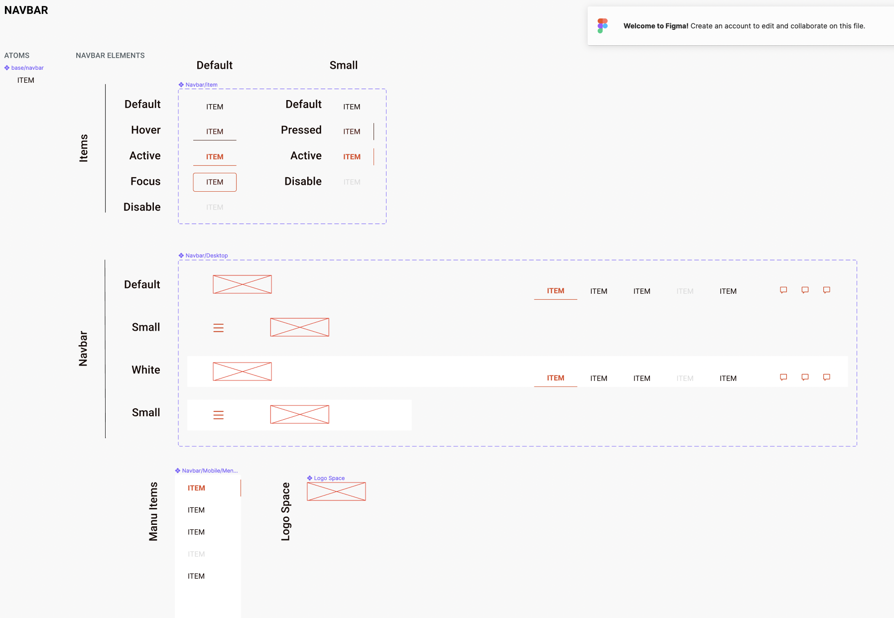

# Navbar

## Overview
Nav is an element in HTML created to represent navigation links. You could say, nav is a container of links that will direct us to other pages. But the link that is in the element `<nav>` is usually a major link that refers to other pages on our website.

- Headers
- Gallery

## Usage

```interactive
<header>
    <nav class="eds-navbar" role="navigation">
        <span class="eds-navbar-toggle" id="js-navbar-toggle">
            <i class="eds-icons menu"></i>
        </span>
        <a class="eds-navbar-brand" href="#">Brand</a>
        <ul class="eds-navbar-links">
            <li class="eds-navbar-item eds-navbar-item--active">
                <a href="#">Home</a>
            </li>
            <li class="eds-navbar-item">
                <a class="eds-navbar-link" href="#">Projects</a>
            </li>
            <li class="eds-navbar-item">
                <a class="eds-navbar-link" href="#">About</a>
            </li>
        </ul>
    </nav>
</header>
```

## Example


## Variants

Small Navbar

```interactive
<header>
    <nav class="eds-navbar eds-navbar-small" role="navigation">
        <span class="eds-navbar-toggle" id="js-navbar-toggle">
            <i class="eds-icons menu"></i>
        </span>
        <a class="eds-navbar-brand" href="#">Brand</a>
        <ul class="eds-navbar-links">
            <li class="eds-navbar-item eds-navbar-item--active>
                <a href="#">Home</a>
            </li>
            <li class="eds-navbar-item""
                <a class="eds-navbar-link" href="#">Projects</a>
            </li>
            <li class="eds-navbar-item">
                <a class="eds-navbar-link" href="#">About</a>
            </li>
        </ul>
    </nav>
</header>
```

## Local Tokens

| token                              | default value                   | description                                      |
| ---------------------------------- | ------------------------------- | ------------------------------------------------ |
| $navbar-menu-icon-color            | theme.colors.$primary           | Icon color                                       |
| $default-font-color                | theme.colors.$secondary-darkest | Text color                                       |
| $hover-font-color                  | theme.colors.$danger-dark       | Text color on hover                              |
| $focus-font-color                  | theme.colors.$danger-dark       | Text color on focus                              |
| $focus-border-color                | theme.colors.$primary           | Border color on focus                            |
| $disabled-font-color               | theme.colors.$disabled          | Text color while disabled                        |
| $navbar-container-vertical-padding | 10px                            | Navbar container padding for vertical measures   |
| $navbar-container-vertical-padding | 10%                             | Navbar container padding for horizontal measures |
| $navbar-brand-padding-top          | 6px                             | Top padding on logo/brand location               |
| $navbar-brand-padding-left         | 20px                            | Left padding on logo/brand location              |
| $navbar-item-border-width          | 1px                             | Border width for navbar item                     |
| $navbar-item-vertical-padding      | 10px                            | Navbar item padding for vertical measures        |
| $navbar-item-horizontal-padding    | 20px                            | Navbar item padding for horizontal measures      |
| $navbar-item-small-width           | 144px                           | Navbar width on small screens                    |
| $font-name                         | theme.fonts.$navbar-font        | Text font family                                 |
| $font-weight                       | theme.fonts.$navbar-weight      | Text font weight                                 |
| $font-size                         | theme.fonts.$navbar-size        | Text font size                                   |
| $line-height                       | theme.fonts.$navbar-line-height | Text line height                                 |
| $spacing                           | theme.fonts.$navbar-spacing     | Text letter spacing                              |


## Theme Tokens
| token              | default value           | description             |
| ------------------ | ----------------------- | ----------------------- |
| $white             | global.colors.$white    | White color             |
| $cta               | global.colors.$blue     | CTA color               |
| $dark-contrast-cta | global.colors.$cta-dark | Dark contrast CTA color |
| $disable           | global.colors.$disable  | Disabled contrast color |


## Global Tokens
| token        | default value | description             |
| ------------ | ------------- | ----------------------- |
| $white       | #fff          | White color             |
| $blue        | #379BD7       | White color             |
| $cta-dark    | #0C2A3C       | Dark Blue color         |
| $disable     | #D9D9D9       | Disabled color          |
| $pill-radius | 24px          | Border radius           |
| $font-name   | Roboto        | Font family             |
| $regular     | 400           | Font weight             |
| $px-button   | 16px          | Button font size        |
| $lh-button   | 15px          | Button text line height |

