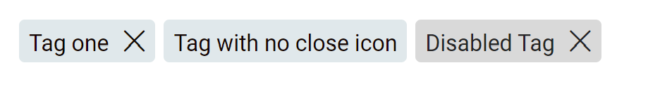

# Tags

## Overview

Tags are compact bits of information, commonly used to represent attributes of an element.

## Usage
```
  <div class="eds-tags">
    <div class="eds-tags__tag" tabIndex="0">
      Tag one
      <span tabIndex="0" class="eds-icon close" onClick={closeAction} />
    </div>
    <div class="eds-tags__tag" tabIndex="0">
      Tag with no close icon
    </div>
    <div class="eds-tags__tag" tabIndex="0" disabled>
      Disabled Tag
      <span tabIndex="0" class="eds-icon close" />
    </div>
  </div>
```

## Example


## Local Tokens

| token                 | default value                     | description                                  |
| --------------------- | --------------------------------- | -------------------------------------------- |
| $idle-font-color      | theme.colors.$content             | Text color                                   |
| $idle-fill-color      | theme.colors.$secondary-light     | Fill color                                   |
| $idle-border-color    | theme.colors.$secondary-light     | Border color                                 |
| $hover-font-color     | theme.colors.$background          | Text color on hover                          |
| $hover-fill-color     | theme.colors.$secondary-dark      | Fill color on hover                          |
| $hover-border-color   | theme.colors.$secondary-dark      | Border color on hover                        |
| $focus-font-color     | theme.colors.$content             | Text color on focus                          |
| $focus-fill-color     | theme.colors.$secondary-light     | Fill color on focus                          |
| $focus-border-color   | theme.colors.$primary             | Border color on focus                        |
| $disable-font-color   | theme.colors.$disabled-dark       | Text color while disabled                    |
| $disable-fill-color   | theme.colors.$disabled            | Fill color while disabled                    |
| $disable-border-color | theme.colors.$disabled            | Border color while disabled                  |
| $border-radius        | theme.shape.$tag-radius           | Smooth corners radius                        |
| $border-width         | 1px                               | Border line width                            |
| $height               | 30px                              | Button height                                |
| $padding              | 6px                               | Separation between borders and text          |
| $margin-right         | 6px                               | Separation between multiple tags             |
| $close-margin         | 10px                              | Separation between close button and text     |
| $font-name            | theme.fonts.$tag-font             | Text font family                             |
| $font-weight          | theme.fonts.$tag-weight           | Text font weight                             |
| $font-size            | theme.fonts.$tag-size             | Text font size                               |
| $line-height          | theme.fonts.$tag-line-height      | Text line height                             |
| $spacing              | theme.fonts.$tag-spacing          | Text letter spacing                          |


## Theme Tokens

| token                 | default value                      | description            |
| --------------------- | ---------------------------------- | ---------------------- |
| $content              | global.colors.$orange-darkest      | Text color             |
| $primary              | global.colors.$orange              | Orange color           |
| $secondary-light      | global.colors.$lightgray-light     | Tag color              |
| $secondary-dark       | global.colors.$lightgray-dark      | Dark contrast color    |
| $disabled             | global.colors.$disable             | Disabled color         |
| $disabled-dark        | global.colors.$disable-dark        | Disabled contrast color|
| $tag-radius           | global.shape.$round-radius         | Border radius          |
| $tag-font             | global.fonts.$font-name            | Text font name         |
| $tag-weight           | global.fonts.$regular              | Text font weight       |
| $tag-size             | global.fonts.$px-tag               | Text font size         |
| $tag-line-height      | global.fonts.$lh-tag               | Text line height       |
| $tag-spacing          | 0.16px                             | Text letter spacing    |


## Global Tokens

| token           | default value | description             |
| --------------- | ------------- | ----------------------- |
| $orange-darkest | #120502       | Dark Orange color       |
| $orange         | #DE411B       | Orange color            |
| $lightgray-light| #E3E6E8       | Lightgray light color   |
| $lightgray-dark | #1C272B       | Lightgray dark color    |
| $disable        | #D9D9D9       | Disabled color          |
| $disable-dark   | #262626       | Disabled dark color     |
| $round-radius   |  4px          | Border radius           |
| $font-name      | Roboto        | Font family             |
| $regular        | 400           | Font weight             |
| $px-tag         | 16px          | Tag font size           |
| $lh-tag         | 15px          | Tag text line height    |

