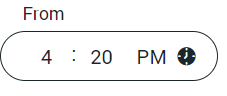

# Timepicker
 
## Overview
 
Specially-purposed component aimed to input time in hour:minute AM/PM format.
 
## Usage

```html
<div class="eds-timepicker">
  <label class="eds-timepicker__label">Label</label>
  <input name="hours" placeholder="00" type="number" min="01" max="12" step="1" class="eds-timepicker__hour"/>
  <span>:</span>
  <input name="minutes" placeholder="00" type="number" min="00" max="59" step="1" class="eds-timepicker__minute"/>
  <select name="ampm" class="eds-timepicker__ampm">
    <option value="am" selected>AM</option>
    <option value="pm">PM</option>
  </select>
</div>
```

## Example



## Variants

No variants.

## Local Tokens
 
| token | default value | description |
| -------------------------- | --------------------- | ------------ |
| $idle-background-color     | theme.colors.$background | background of the input when idle |
| $idle-border-color         | theme.colors.$secondary-mid | border of the input when idle |
| $idle-font-color           | theme.colors.$secondary-dark | font color for the content when idle |
| $border-radius             | theme.shape.$input-radius | border radius for the input |
| $font-name                 | theme.fonts.$input-font | input font |
| $font-weight               | theme.fonts.$input-weight | input font weight |
| $font-size                 | theme.fonts.$input-size | input font size |
| $line-height               | theme.fonts.$input-line-height | input line height |
| $letter-spacing            | theme.fonts.$input-spacing | input letter spacing |
| $label-font-size           | theme.fonts.$label-size | font size for the label |
| $label-font-name           | theme.fonts.$input-font | font used in the label |
| $focus-background-color    | theme.colors.$background | background color of the input when focused|
| $border-width              | 1px | width of the input border |
| $height                    | 40px | height of the input |
| $padding-bottom            | 11px | Inner padding of the timepicker |
| $padding-top               | 11px | Inner padding of the timepicker |
| $padding-left              | 16px | Inner padding of the timepicker |
| $padding-right             | 16px | Inner padding of the timepicker |
| $label-distance-top        | -21px | Distance of the label from the top of the timepicker |
| $label-distance-left       | 17px | Distance of the label from the left edge of the timepicker |


## Theme Tokens
 
| token | default value | description | 
| ----------------------------------- | ----------------------------- | ------------ |
| theme.colors.$secondary-dark        | global.colors.$ligthgray-dark | dark shade of the secondary color |
| theme.colors.$background            | global.colors.$white          | color used mostly for backgrounds |
| theme.colors.$secondary-light       | global.colors.$lightgray-light| color used for focused content |
| theme.shape.$input-radius           | global.shape.$pill-radius     | border radius for Timepicker |
| theme.fonts.$input-font             | global.fonts.$font-name       | font for the inputs |
| theme.fonts.$input-weight           | global.fonts.$regular         | font weight used in inputs |
| theme.fonts.$input-size             | 16px                          | font size for input content |
| theme.fonts.$input-spacing          | 0.16px                        | letter spacing for inputs |
| theme.fonts.$timestamp-line-height  | 12px                          | line height for input content |
| theme.fonts.$timestamp-label-size   | 14px                          | font size for the input label |
 
## Global Tokens
 
| token | default value | description | 
| ----------------------------- | ------- | ------------ |
| global.colors.$lightgray-dark | #1C272B | Lightgray dark shade |
| global.colors.$lightgray-light| #E0E8EB | Lightgray light shade |
| global.colors.$white          | #fff    | White color |
| global.shape.$pill-radius     | 24px    | Border radius for the pill shape |
| global.fonts.$regular         | 400     | Regular font weight |
| global.fonts.$lh-button       | 15px    | Button line height |
| global.fonts.$font-name       | Roboto  | Font name | 