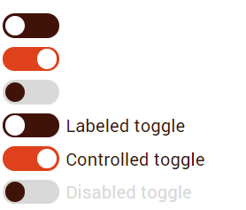

# Toggle

## Overview
The toggle component is a checkbox styled to look like an On / Off switch.

## Usage

```
<input id="Toggle_id" type="checkbox" class="eds-toggle" value="Input value" [checked] [disabled] />
[<label for="Toggle_id" class="eds-toggle__label ">Optional toggle label</label>]
```

## Example


## Variants
Checked toggle 

```
<input id="Toggle_id" type="checkbox" class="eds-toggle" value="Input value" checked />
```

Disabled toggle 

```
<input id="Toggle_id" type="checkbox" class="eds-toggle" value="Input value" disabled />
```

Labeled toggle 

```
<input id="Toggle_id" type="checkbox" class="eds-toggle" value="Input value" />
<label for="Toggle_id" class="eds-toggle__label ">Toggle label</label>
```
<!-- Maybe add a square variant later? Ask design team for input -->


## Local Tokens
| Token                  | Default value                      | Description                     |
| ---------------------- | ---------------------------------- | ------------------------------- |
| $width                 | 51px                               | Width of the toggle             |
| $height                | 22px                               | Height of the toggle            |
| $circle-size           | 18px                               | Size of the circle              |
| $check-size            | 14px                               | Size of the check/uncheck mark  |
| $toggle-padding        | 4px 8px                            | Padding inside the toggle       |
| $radius                | $height / 2                        | Border radius                   |
| $circle-color          | theme.colors.$white                | Circle color                    |
| $check-color           | theme.colors.$white                | Check/uncheck color             |
| $disabled-circle-color | theme.colors.$dark-disable         | Disabled circle color           |
| $on-color              | theme.colors.$base                 | Checked background color        |
| $off-color             | theme.colors.$dark-contrast        | Unchecked background color      |
| $disabled-color        | theme.colors.$disable              | Disabled circle color           |
| $font-color            | theme.colors.$dark-contrast        | Label color                     |
| $font-name             | theme.fonts.$toggle-font           | Label font family               |
| $font-size             | theme.fonts.$toggle-font-size      | Label font size                 |
| $font-weight           | theme.fonts.$toggle-font-weight    | Label font weight               |
| $line-height           | theme.fonts.$toggle-line-height    | Label line-height               |
| $letter-spacing        | theme.fonts.$toggle-letter-spacing | Label letter spacing            |
| $box-margin            | 6px                                | Margin between toggle and label |

## Theme Tokens
| Token                  | Default value                 | Description             |
| ---------------------- | ----------------------------- | ----------------------- |
| $base                  | global.colors.$orange         | Base color              |
| $white                 | global.colors.$white          | White color             |
| $dark-contrast         | global.colors.$orange-dark    | Dark contrast color     |
| $disable               | global.colors.$disable        | Disabled color          |
| $dark-disable          | global.colors.$darkdisable    | Disabled contrast color |
| $toggle-font           | global.fonts.$font-name       | Label font family       |
| $toggle-font-weight    | global.fonts.$regular         | Label font weight       |
| $toggle-font-size      | global.fonts.$px-button       | Label font size         |
| $toggle-line-height    | 22px                          | Label line-height       |
| $toggle-letter-spacing | 0.16px                        | Label letter spacing    |

## Global Tokens
| Token         | Default value | Description             |
| ------------- | ------------- | ----------------------- |
| $orange       | "orange"      | Orange color            |
| $white        | "white"       | White color             |
| $disable      | "disable"     | Disabled color          |
| $darkdisable  | "darkdisable" | Disabled contrast color |
| $font-name    | Roboto        | Font family             |
| $regular      | 400           | Font weight             |
| $button, "px" | 16px          | Button font size        |