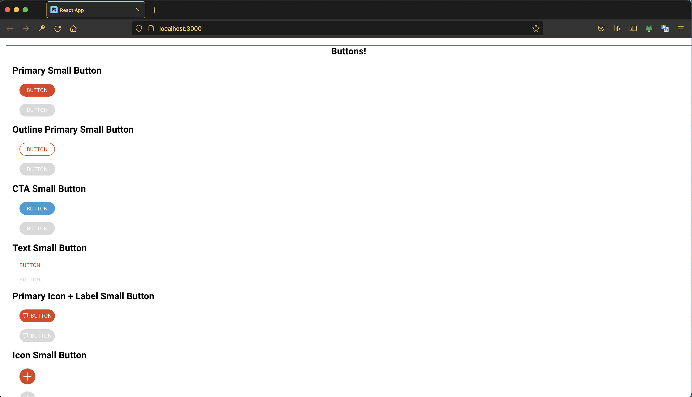

## 🧸 css/sandbox

React project to get a quick visualization of the `e-toast/css` core.

# 🧰 Tech Stack


# 🚀 Launch

1. Install dependencies for the sandbox project

```zsh
npm install
```

2. Build the css package:

```zsh
npm run build
```

3. Start the local server:

```zsh
npm run start
```

4. Open [http://localhost:3000](http://localhost:3000) to view it in the browser.

> Note: if the port 3000 is being used by another project, the command line will ask you if you want to mount the server in a different port.

Your localhost should looks like:


