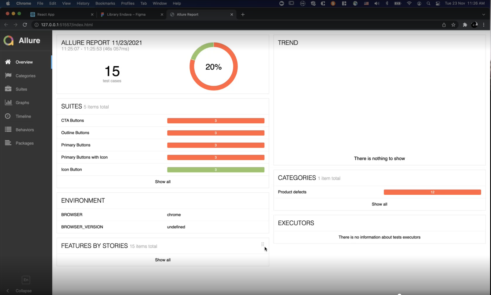

# 🧸 Toasty

React project to get a quick visualization of the `e-toast/css` core.

# 📁 Folder Structure

- `/allure-results`: folder to store the allure resports
- `/assets`: folder to store static content
- `/test`: main folder
- `/test/entities`: folder to store the global setups
- `/test/pageobjects`: folder with the page object of the e-toast atoms
- `/test/specs`: folder with the e-toast atoms unit test


## 🧰 Tech Stack
- [Google Chrome](https://www.google.com/chrome/)
- [Designer Tools](https://chrome.google.com/webstore/detail/designer-tools/jiiidpmjdakhbgkbdchmhmnfbdebfnhp?hl=en) Chrome Extension for manual testing
- [Web Driver IO](https://webdriver.io) a.k.a wdio
- [Allure Framework](https://webdriver.io)

## 🚀 Launch

1. Install dependencies for the sandbox project

```zsh
npm install
```

2. Run tests with wdio

```zsh
npm run start
```

or

```zsh
npm run test
```


3. Run test with report

```zsh
npm run test-with-report
```

> Note: to use allure, you need to install the framework for macOS you can installed via [Homebrew](https://brew.sh), and for Windows use [Scoop](http://scoop.sh)

Your allure report should looks like:



## 🤏 Manual Testing

First testing approach, mainly visual testing. The goal is ensure that element have the CSS specs according the Figma Documentation.

## 🤖 Automation Testing

Automated testing vie WebDriveIO.